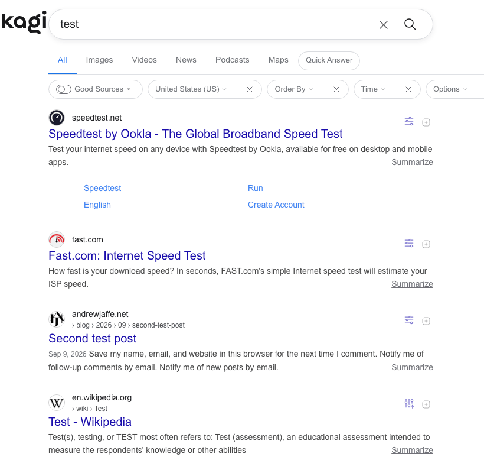
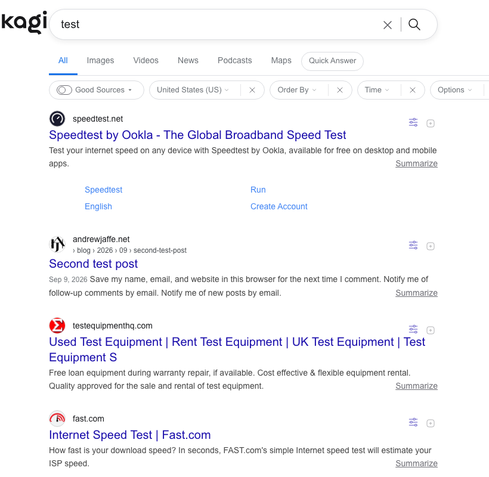
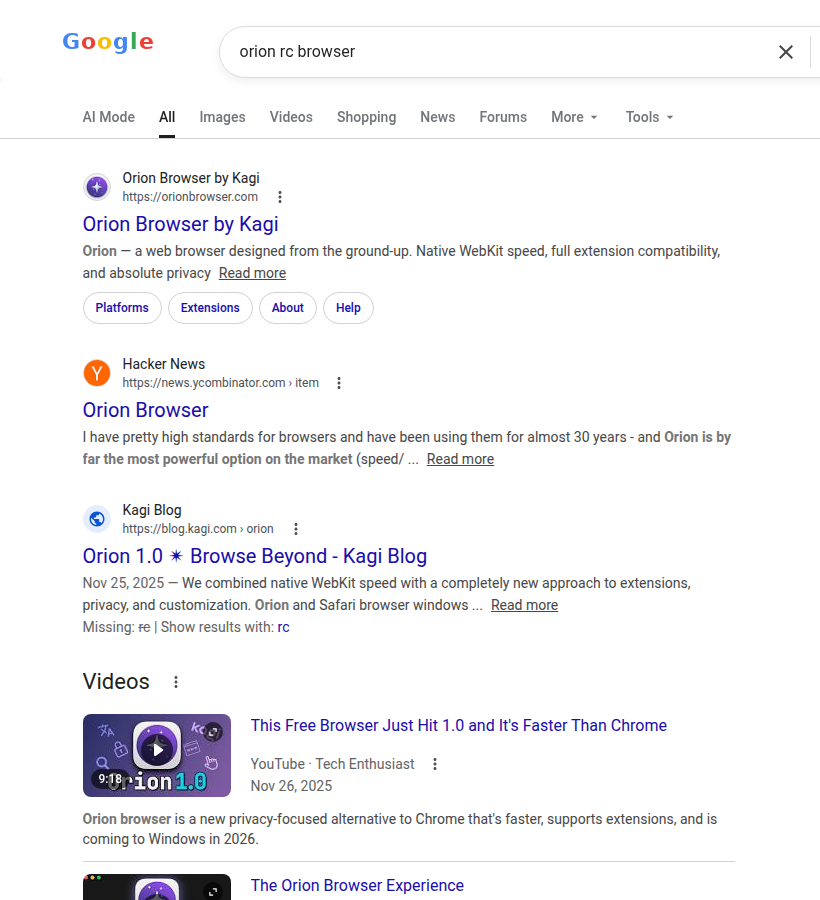
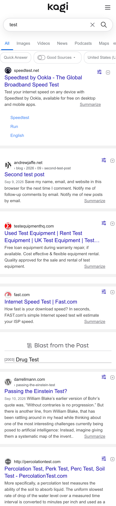

# Kagi Google-Style Theme

A CSS theme that makes [Kagi Search](https://kagi.com) look like Google.

I wanted to switch to Kagi but kept missing Google's layout. Stockhold syndrome or not, I think this recreates the parts I like while letting me avoid actually using it.



| Kagi + this theme | Google for reference | Mobile |
|:-:|:-:|:-:|
|  |  |  |

## Install

1. Copy the contents of [`custom.css`](custom.css)
2. Go to [Kagi Settings > Appearance > Custom CSS](https://kagi.com/settings?p=custom_css)
3. Paste and save

Set your Kagi theme to **Default** (light) first.

## Development

`custom.css` is the built, minified file you paste into Kagi — edit `src/custom.css`
instead, then rebuild:

```sh
cd test && npm i && cd ..
node build.js
```

The build fails rather than writing if the result exceeds Kagi's 40000-character
cap for custom CSS.

`test/verify.js` drives a real Kagi session (Playwright) to check the filter bar
and the advanced-search date range on desktop and mobile. It needs a session token
in `test/session-token.txt`, from [Settings > User Details](https://kagi.com/settings/user_details).

## Customization

Colors and dimensions are CSS variables at the top of `src/custom.css`:

```css
:root {
    --g-link: #1a0dab;
    --g-text: #202124;
    --g-result-width: 652px;
    --g-font-body: Arial, sans-serif;
    /* ... */
}
```

Rebuild with `node build.js` after changing them.

## License

[MIT](LICENSE)
tl;dr: use for anything but attribute
